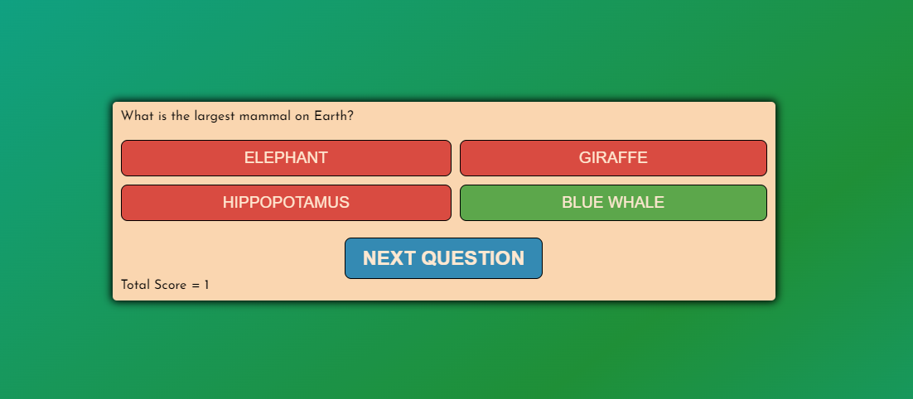
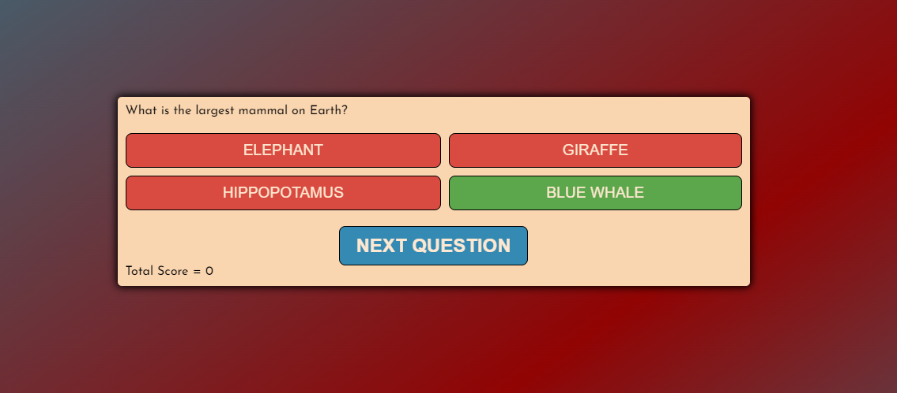
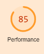
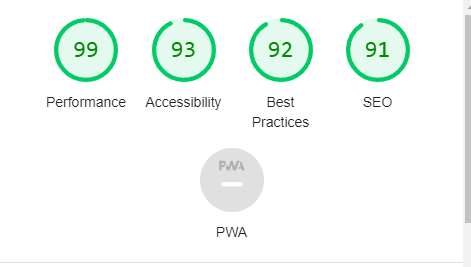
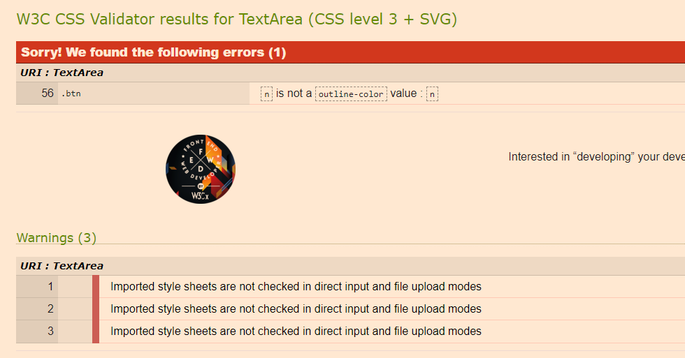
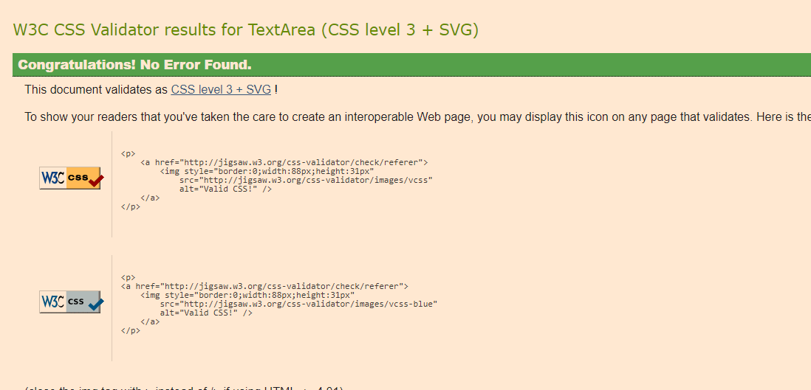

## Quiz Game
This project is a simple quiz game that challenges users with a series of questions on different topics. The game provides multiple-choice options for each question, and the user must select the correct answer. The project is designed to be interactive, engaging, and easy to navigate.

## Features:
Homepage: The quiz game starts on the homepage, where users can click the "Start Quiz" button to begin playing.
Questions: Each question is displayed one at a time, and the user must choose one of the provided answers.
Scoring: The user's total score is displayed in real-time as they progress through the quiz.

Feedback: After each answer selection, the user receives immediate feedback indicating whether their answer was correct or wrong and the background changes either to green with blue or red with blue which matches the theme throughout from the homepage.

Restart: Once the quiz is completed, the user has the option to restart the game by clicking the "Restart" button.

Styling: The website has a responsive and visually appealing design, with a color scheme that changes based on correct or wrong answers and is followed throughout.

## Stratergy:

The main objectives of this project are:

- To provide an entertaining quiz game that challenges users' knowledge.
- To engage users with interactive elements and immediate feedback.
- To showcase the use of HTML, CSS, and JavaScript to create an interactive web application.

### Quiz target auidence:
- Male and female
- individuals looking to test their knowledge
- Those who enjoy interactive web experiences.
- wide range of ages , anyone interested in common knowledge quizes

### What these users would be looking for:

- Easy site with appealing information
- shows correct and wrong answer
- tally count

## Structure:

## This is a multi page quiz consisting of the following:

- index.html: The main HTML file containing the structure and layout of the quiz game.
- style.css: The CSS file that handles the styling and layout of the website.
- script.js: The JavaScript file responsible for the game's functionality and interactivity.

### The quiz game is designed with the following pages:

- Homepage: The start page of the quiz game with a "Start Quiz" button.
- Question Page: Each question is displayed individually, and users can select an answer.
- Result Page: After completing the quiz, the user is presented with their final score and the option to restart the game.
- Installation

To run the quiz game locally, follow these steps:

Clone or download the repository to your local machine.
Open the index.html file in your web browser.
Technologies Used
HTML
CSS
JavaScript

Future Enhancements

Unfortunately, due to personal grievances, which led me to loose my first project which was a memory game i had to restart project 2 as a quiz due to time and I was unable to implement other ideas I wanted to include in this quiz. My time was cut very short; however, if I had more time, I would have been able to add them.
  
- Add a timer to each question to make the game more challenging.
- Implement a database to store high scores and allow users to compete with others.
- Expand the question bank to offer a more extensive quiz experience.
- Creating a contents page where it links to different quiz challenges depending on the topic/subject.

## Technologies Used:

[HTML](https://developer.mozilla.org/en-US/docs/Web/HTML)
- Used as the basic building block for the project and to structure the content.

[CSS](https://developer.mozilla.org/en-US/docs/Learn/Getting_started_with_the_web/CSS_basics)
- Used as the basic building block for the project and to structure the content.

[Google Fonts](https://fonts.google.com/)
- Used as the basic building block for the project and to structure the content.

[Font Awesome](https://fontawesome.com/)
- Used as the basic building block for the project and to structure the content.

[GitHub](https://github.com/)
- Used to store code for the project after being pushed.

[Git](https://git-scm.com/)
- Used for version control by utilising the Gitpod terminal to commit to Git and Push to GitHub.

[Gitpod](https://www.gitpod.io/)
- Used as the development environment.

[Balsamiq](https://www.figma.com/)
- Used to create the wireframes for the project.

[WebDev](https://courses.webdevsimplified.com/)
- Watched a few tutorials for ideas.

[Youtube](www.youtube.co.uk)
- Watched and studied many videos to catchup on time missed due to grievances.

[W3C CSS Validation Service](https://jigsaw.w3.org/css-validator/#validate_by_input)
- Used to validate all CSS code written and used in this webpage.

[W3C Markup Validation Service](https://validator.w3.org/)
- Used to validate all HTML code written and used in this webpage.

[Bootstrap](https://getbootstrap.com/)
- Obtained some code and reseacrched and learnt various coding methods

[uizard](https://uizard.io/)
- Replacement application to create wireframes since balsamiq stopped working.

# Testing

### User Stories: 

As a first time visitor i want to easily flick through the questions whilst the tally is keeping count. As you can see if i answer corrcetly the tally will go up by 1 , and if i answer incorrectly the tally will go down .

As A first time User i want to easily know whether ive answered correctly or incorrectly , which is easily noticeable by the background which changes colour, green for correct answer or red for incorrect.

## Lighthouse

Lighthouse is a very good & useful tool found in chrome developor and is used to show the websites

- Performance
- Accessibility
- Best Practices
- SEO

As shown above my initial performance was in the ornage at 85 , which after a few improvements and corrections it improved and is now in the green as you can see below.

## HTML and CSS Validation:

I often validated my HTML and CSS code whilst building the website to avoid making the same small errors and to decrease work load at end of project. 

Upon running my HTML code i had 0 problems due to the fact i was continuosly keeping an eye on it, however i did encounter a error when i went to validate my CSS code as you can see below.

As you can see it was a very simple mistake , a word which was mistyped. After fixing this error the site has 0 errors.

## Deployment:
1. Log in to GitHub
2. In your Repository section, select the project repository that you want to deploy
3. In the menu located at the top of this section, click 'Settings'
4. Select 'Pages' on the left-hand menu - this is around halfway down
5. In the source section, select branch 'Master' and save
6. The page is then given a site URL which you will see above the source section, it will look like the following:

Please note it can take a while for this link to become fully active.

## Forking the GitHub Repository
If you want to make changes to your repository without affecting it, you can make a copy of it by 'Forking' it. This ensures your original repository remains unchanged.

1. Find the relevant GitHub repository
2. In the top right corner of the page, click the Fork button (under your account)
3. Your repository has now been 'Forked' and you have a copy to work on
## Cloning the GitHub Repository
Cloning your repository will allow you to download a local version of the repository to be worked on. Cloning can also be a great way to backup your work.

1. Find the relevant GitHub repository
2. Press the arrow on the Code button
3. Copy the link that is shown in the drop-down
4. Now open Gitpod & select the directory location where you would like the clone created
5. In the terminal type 'git clone' & then paste the link you copied in GitHub
6. Press enter and your local clone will be created.

